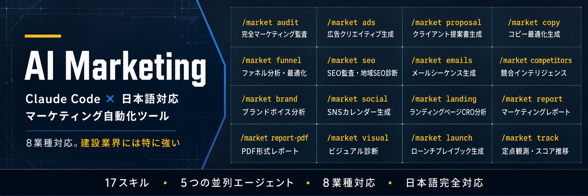

<p align="center">
  
</p>

# AI Marketing Suite for Claude Code

[Claude Code](https://docs.anthropic.com/en/docs/claude-code) 向けの、日本市場向けマーケティング分析・自動化スキルシステムです。

**8つの業種に対応した汎用ツールで、その中でも建設業界（工務店・リフォーム会社）向けの機能が特に充実しています。**

サイトのURLを渡すだけで業種を自動判定し、評価の重点・収益試算・提案の言い回しを業種に合わせて調整します。

---

## 8つの業種に対応

分析対象のサイトから業種を自動判定し、それぞれの業種で重視すべき指標に評価の重点を合わせます。

| 業種 | 評価の重点 |
|---|---|
| SaaS・ソフトウェア | トライアル→有料転換・オンボーディング・機能ページ・料金プラン |
| EC・通販 | 商品ページ・カート放棄・アップセル・レビュー |
| エージェンシー・サービス業 | 事例・ポートフォリオ・お問い合わせフォーム・信頼シグナル |
| ローカルビジネス | Googleビジネスプロフィール・ローカルSEO・口コミ・アクセス情報 |
| クリエイター・講座 | リードマグネット・メール登録・推薦文・コミュニティ |
| マーケットプレイス | 双方向メッセージング・需給バランス・信頼メカニズム |
| **建設・建築業** | 施工実績・建設業許可・有資格者・お問い合わせ・来場予約 |
| 製造業・BtoB | カタログ請求・展示会申込・見積依頼・取引実績・ISO認証 |

### 建設業界には特に強い対応をしています

建設業界は、他業種のマーケティングツールがそのまま通用しない固有の事情が多いため、専用の評価軸を用意しています。

| 建設業界の特性 | 一般的なツールの問題点 | 本ツールの対応 |
|---|---|---|
| 受注は**紹介・口コミ中心** | Web CVR改善の提案が的外れ | お問い合わせ・来場・紹介獲得を主要CVに設定 |
| **長い商談サイクル**（数ヶ月〜1年） | 即決クロージング前提の提案 | 段階的な信頼構築・稟議文化に対応した提案 |
| **建設業許可・有資格者**が信頼の核心 | 一般的な「信頼シグナル」評価 | 許可番号・施工実績・有資格者数を重点評価 |
| **現場写真・施工事例**が最大の訴求力 | テキストコピー中心の分析 | ビジュアルコンテンツの充実度を重視 |
| **地域密着**が競合優位性の源泉 | グローバル・全国視点の競合分析 | 地域（市区町村レベル）での競合調査に対応 |
| **Googleマップ・口コミ**が集客の主戦場 | サイト内分析のみ | Googleビジネスプロフィールの評価を含む |
| **高齢経営者・職人気質**の意思決定者 | デジタルネイティブ前提の提案 | 対面・電話・訪問を重視した導線設計を評価 |

---

## できること

Claude Code でコマンドを入力するだけで、業種を問わずウェブサイトを即座に分析できます：

```
> /market audit https://example.co.jp

業種を判定中... エージェンシー・サービス業と判定
5つのエージェントを起動中...
✓ コンテンツ・メッセージング分析     — スコア：72/100
✓ コンバージョン最適化               — スコア：58/100
✓ SEO・発見可能性                    — スコア：81/100
✓ 競合ポジショニング                  — スコア：64/100
✓ ブランド・信頼性                    — スコア：76/100
✓ 成長・戦略                          — スコア：61/100

総合マーケティングスコア：69/100

詳細レポートを example.co.jp/MARKETING-AUDIT.md に保存しました
```

分析結果は、分析対象のドメイン名フォルダ（例：`example.co.jp/`）に自動でまとめて保存されます。複数のサイトを分析しても、ファイルが混ざりません。

---

## インストール

### 方法1：プラグインとして導入（推奨）

Claude Code のプラグインとして導入します。更新も `/plugin` から行えます。

```bash
claude plugin marketplace add buildmate-gif/AI_Marketing
```

追加後、`/plugin` から `ai-marketing-jp` を有効化してください。

### 方法2：ワンコマンドでインストール

```bash
curl -fsSL https://raw.githubusercontent.com/buildmate-gif/AI_Marketing/main/install.sh | bash
```

### 方法3：手動インストール

```bash
git clone https://github.com/buildmate-gif/AI_Marketing.git
cd AI_Marketing
./install.sh
```

### PDFレポート機能を使う場合

```bash
pip install reportlab
```

---

## コマンド一覧

用途別に6つのグループに分かれています。**コマンドを覚えていなくても、「このサイトを診断して」「Instagramの投稿計画を作って」のように自然文で話しかければ、該当するスキルが自動で起動します。**

### 1. 診断する

| コマンド | 内容 | 活用例 |
|---|---|---|
| `/market audit <url>` | 完全マーケティング監査 | 営業前のクライアントサイト事前調査 |
| `/market quick <url>` | 60秒スナップショット | 初回商談前の即席チェック |
| `/market seo <url>` | SEO監査・地域SEO診断 | 地域名＋業種のキーワード対策 |
| `/market landing <url>` | ランディングページCRO分析 | LPの問い合わせ率改善提案 |
| `/market funnel <url>` | ファネル分析・最適化 | 問い合わせ→商談→契約の導線分析 |
| `/market visual <url>` | ビジュアル診断（見た目の採点） | ファーストビューの印象、施工写真・商品写真の見せ方 |

### 2. 調べる

| コマンド | 内容 | 活用例 |
|---|---|---|
| `/market competitors <url>` | 競合インテリジェンス | 同業種・同地域の競合比較、Googleマップ順位の確認 |
| `/market brand <url>` | ブランドボイス分析 | 敬語レベル・一人称の統一チェック |

### 3. 作る

| コマンド | 内容 | 活用例 |
|---|---|---|
| `/market copy <url>` | コピー最適化生成 | 実績・強みの訴求文改善 |
| `/market emails <トピック>` | メールシーケンス生成 | 問い合わせ後の追客・成約後のフォロー |
| `/market social <トピック>` | SNSカレンダー生成 | 商品・サービス・実績の投稿計画 |
| `/market ads <url>` | 広告クリエイティブ生成 | ターゲティング広告の文案 |

### 4. 納品する

| コマンド | 内容 | 活用例 |
|---|---|---|
| `/market report <url>` | マーケティングレポート | クライアントへの納品レポート |
| `/market report-pdf <url>` | PDF形式レポート | 印刷・持参できるPDF資料 |
| `/market proposal <会社名>` | クライアント提案書生成 | Web改善・マーケティング支援の提案書を自動作成 |

### 5. 立ち上げる

| コマンド | 内容 | 活用例 |
|---|---|---|
| `/market launch <サービス>` | ローンチプレイブック生成 | 新サービス・新商品・イベントの立ち上げ計画 |

### 6. 継続する

| コマンド | 内容 | 活用例 |
|---|---|---|
| `/market track <url>` | 定点観測・スコア推移レポート | 月次報告、契約更新時の効果提示 |

`/market track` はスコアと実測値（問い合わせ件数・Googleクチコミ・地図検索順位など）を `MARKET-HISTORY.json` に蓄積し、前回比・初回比の推移表を生成します。

```
| 測定日 | 総合 | 前回比 | 実施した施策 |
|---|---|---|---|
| 2026-04-10 | 62/100 | — | 初回監査 |
| 2026-06-10 | 71/100 | ▲9 | フォームを5項目に削減、許可番号を常時表示 |
| 2026-07-25 | 79/100 | ▲8 | 地域名＋工種ページを10本追加 |
```

**単発の診断で終わらせず、継続支援の根拠を作るための機能です。**

---

## コマンド詳細ガイド

### 📌 URL系コマンドとトピック系コマンドの違い

| 種類 | 入力するもの | 動作のしくみ |
|------|------------|------------|
| **URL系** | `https://...` のWebアドレス | サイトを読み取って自動分析 |
| **トピック系** | キーワード（商品・サービス・工事種別など） | キーワードをもとにAIがコンテンツを生成 |
| **提案書系** | 会社名（＋URLも可） | 社名と文脈から提案資料を自動作成 |

---

### 📧 `/market emails <topic>` — メールシーケンス生成

問い合わせ後のフォローアップメールを、**業種のキーワード**をもとに自動生成します。

**入力例（`<topic>` の部分に入れるキーワード）：**

```
/market emails 外壁塗装
/market emails 外構工事
/market emails 営業代行
/market emails オンライン講座
/market emails 美容室予約
```

**出力される内容（例：`外構工事`の場合）：**

| 通数 | タイミング | 内容 |
|------|----------|------|
| 1通目 | 問い合わせ翌日 | お礼メール＋会社・実績の簡単な紹介 |
| 2通目 | 3日後 | 施工事例・ビフォーアフター紹介 |
| 3通目 | 1週間後 | よくある質問への回答（費用・工期・素材など） |
| 4通目 | 2週間後 | 現地調査・お見積もりの案内 |
| 5通目 | 1ヶ月後 | 季節のご挨拶＋限定キャンペーン・次のアクション促進 |

> 📝 **ポイント**：トピックを変えるだけで内容が変わります。「営業代行」なら商談化率の実績訴求、「オンライン講座」なら受講者の声の紹介など、業種に特化した文面が生成されます。

---

### 📅 `/market social <topic>` — SNSカレンダー生成

商品・サービスのテーマをキーワードに入れると、**1ヶ月分のSNS投稿計画**を自動生成します。

**入力例（`<topic>` の部分に入れるキーワード）：**

```
/market social 塗装工事
/market social 新築工務店
/market social 美容サロン
/market social ECサイト新作
```

**出力される内容（例：`塗装工事`の場合）：**

| 投稿日 | テーマ | キャプション案の方向性 |
|--------|--------|------------------|
| 1日 | 施工前後の比較写真 | 「築15年の外壁が…見違えるほど綺麗に」 |
| 5日 | スタッフ・職人紹介 | 「塗装歴20年のベテランが丁寧に施工します」 |
| 10日 | お客様の声・口コミ | 「ご近所の方に声をかけていただくほど…」 |
| 15日 | 使用塗料・素材紹介 | 「なぜこの塗料を選ぶのか、理由をお話しします」 |
| 20日 | よくある質問 | 「塗装の時期はいつがベスト？プロが解説」 |
| 25日 | 地域密着エピソード | 「○○市での施工件数が100件を突破しました」 |
| 月末 | 来月の予告・CTA | 「来月は無料点検キャンペーンを実施します」 |

> 📝 **ポイント**：投稿のテーマだけでなく、ハッシュタグ案・投稿の曜日・時間帯の推奨も含めて出力されます。InstagramやFacebookなど媒体別の調整も可能です。

---

### 📄 `/market proposal <client>` — クライアント提案書生成

> ⚠️ **このコマンドはURLではなく「会社名」を入力します。**

Web改善・マーケティング支援の提案書を、クライアントの社名をもとに自動作成します。

**入力例（`<client>` の部分に入れるもの）：**

```
/market proposal 田中工務店
/market proposal 大阪建設株式会社
/market proposal 関西マーケティング支援
```

**URLと組み合わせると精度が上がります（推奨）：**

```
/market proposal 田中工務店 https://tanaka-kensetsu.co.jp
```

**出力される提案書の構成例：**

```
■ 株式会社田中工務店 様
  マーケティング戦略 ご提案書

  1. エグゼクティブ・サマリー
  2. 現状分析（競合比較を含む）
  3. 戦略とアプローチ（フェーズ別）
  4. 業務範囲
  5. スケジュール
  6. ご投資額（松竹梅の3プラン）
  7. 投資対効果の見込み
  8. 体制
  9. 実績・事例
  10. 次のステップ
```

> 📝 **ポイント**：社名のみ入力した場合、Claude Codeが「業種・エリア・現在の課題」などを追加で質問してきます。事前にサイトURLや `/market audit` の分析結果があると、より精度の高い提案書が生成されます。

---

## スコアリング方式

| カテゴリ | ウェイト |
|---------|--------|
| コンテンツ・メッセージング | 25% |
| コンバージョン最適化 | 20% |
| SEO・発見可能性 | 20% |
| 競合ポジショニング | 15% |
| ブランド・信頼性 | 10% |
| 成長・戦略 | 10% |

**総合マーケティングスコア** = 全カテゴリの加重平均（0〜100点）。各カテゴリで評価する具体的な観点は、上記の業種判定に応じて自動調整されます。

**例：建設業の場合の評価ポイント**

| カテゴリ | 建設業界での評価ポイント |
|---------|----------------------|
| コンテンツ・メッセージング | 施工実績・着工件数・対応エリアの明確さ |
| コンバージョン最適化 | お問い合わせ・来場予約・資料請求の導線 |
| SEO・発見可能性 | 地域名＋工種キーワード・Googleマップ連携 |
| 競合ポジショニング | 地域内での差別化・専門工種の訴求 |
| ブランド・信頼性 | 建設業許可番号・有資格者・施工写真の充実度 |
| 成長・戦略 | 紹介獲得の仕組み・OB顧客フォロー体制 |

---

## 対象ユーザー

- クライアントのマーケティング改善を支援するコンサルタント・エージェンシー（業種を問わず）
- 建設会社・工務店・リフォーム会社のDX・Web改善を支援する専門コンサルタント
- 自社のWeb集客を改善したい経営者・マーケティング担当者

---

## アンインストール

```bash
./uninstall.sh
```

または手動で：

```bash
rm -rf ~/.claude/skills/market*
rm -f ~/.claude/agents/market-*.md
```

---

## ライセンス

MITライセンス — 詳細は [LICENSE](LICENSE) をご覧ください。
